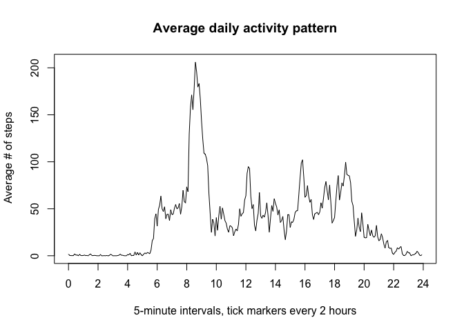

# Reproducible Research: Peer Assessment 1

## Loading and preprocessing the data

Here the data are downloaded.


```r
temp <- tempfile()
download.file("http://d396qusza40orc.cloudfront.net/repdata%2Fdata%2Factivity.zip", temp, quiet = TRUE)
filename <- unzip(temp, list = TRUE)[1, 1]
dat <- read.csv(unz(temp, filename))
unlink(temp)
rm(temp)
head(dat)
```

```
##   steps       date interval
## 1    NA 2012-10-01        0
## 2    NA 2012-10-01        5
## 3    NA 2012-10-01       10
## 4    NA 2012-10-01       15
## 5    NA 2012-10-01       20
## 6    NA 2012-10-01       25
```

To transform the data for the first problem, we build a data frame `steps_day` containing the dates and the sum of the steps for each day. We do that by running a `for` loop to create a vector containing the date and its respective sum of steps and `rbind`ing that vector as a data frame until we have all 61 days accounted for.


```r
dates <- as.vector(unique(dat["date"])[,1])
steps_day <- data.frame()
for (i in seq_along(dates)){
        steps_sum <- c(dates[i], sum(dat["steps"][dat["date"] == dates[i]], na.rm = T))
        steps_day <- rbind(steps_day, data.frame(
                as.Date(steps_sum[1], format = "%Y-%m-%d"), 
                as.integer(steps_sum[2])
                ))
}; rm(i, steps_sum)
names(steps_day) <- names(dat)[c(2, 1)]
head(steps_day)
```

```
##         date steps
## 1 2012-10-01     0
## 2 2012-10-02   126
## 3 2012-10-03 11352
## 4 2012-10-04 12116
## 5 2012-10-05 13294
## 6 2012-10-06 15420
```

```r
str(steps_day)
```

```
## 'data.frame':	61 obs. of  2 variables:
##  $ date : Date, format: "2012-10-01" "2012-10-02" ...
##  $ steps: int  0 126 11352 12116 13294 15420 11015 0 12811 9900 ...
```

## What is mean total number of steps taken per day?

Here is the histogram of the steps per day.


```r
hist(steps_day$steps, breaks = 11,
     main = "Histogram of steps/day",
     xlab = "Steps per day"
     )
```

 

And calculated here are the mean and median total number of steps taken per day.


```r
mean(steps_day$steps)
```

```
## [1] 9354.23
```

```r
median(steps_day$steps)
```

```
## [1] 10395
```

## What is the average daily activity pattern?

Using a similar procedure as used for `steps_day` to make a data frame `steps_intv`, contaning two columns, the 5-minute interval and the average number of steps taken, averaged across all days, respectively. As column `interval` is in format `"%H%M"` but improperly formatted, zeroes are appended to the start of each interval shorter than 4 characters so that `"5"` becomes `"0005"`, which can be converted to a total hour/minute count using the class `"difftime"`.


```r
time <- as.vector(unique(dat["interval"])[,1])
steps_intv <- data.frame()
for (i in seq_along(time)){
        steps_mean <- c(time[i], mean(dat["steps"][dat["interval"] == time[i]], na.rm = T))
        steps_mean[1] <- as.character(steps_mean[1])
        steps_mean_timelength <- length(unlist(strsplit(steps_mean[1], "")))
        zeroes <- c("0", "0", "0", "0")
        if (steps_mean_timelength != 4) {
                length(zeroes) <- 4 - steps_mean_timelength
                steps_mean[1] <- paste0(paste(zeroes, collapse = ""), steps_mean[1])
        }; rm(zeroes, steps_mean_timelength)
        steps_intv <- rbind(steps_intv, data.frame(
                as.difftime(steps_mean[1], format = "%H%M", units = "hours"),
                as.numeric(steps_mean[2])
                ))
}; rm(i, steps_mean)
names(steps_intv) <- names(dat)[c(3, 1)]
head(steps_intv)
```

```
##           interval     steps
## 1 0.00000000 hours 1.7169811
## 2 0.08333333 hours 0.3396226
## 3 0.16666667 hours 0.1320755
## 4 0.25000000 hours 0.1509434
## 5 0.33333333 hours 0.0754717
## 6 0.41666667 hours 2.0943396
```

```r
str(steps_intv)
```

```
## 'data.frame':	288 obs. of  2 variables:
##  $ interval:Class 'difftime'  atomic [1:288] 0 0.0833 0.1667 0.25 0.3333 ...
##   .. ..- attr(*, "units")= chr "hours"
##  $ steps   : num  1.717 0.3396 0.1321 0.1509 0.0755 ...
```

Here is the time series plot of the 5-minute interval (x-axis) and the average number of steps taken, averaged across all days (y-axis).


```r
plot(steps_intv, type = "l",
     xaxp  = c(0, 24, 12),
     main = "Average daily activity pattern", 
     xlab = "5-minute intervals, tick markers every 2 hours", 
     ylab = " Average # of steps"
     )
```

 

For the next question, the `"units"` attribute of the `"interval"` column in the data frame will be changed from `"hours"` to `"mins"`. From there, we can find where the maximum is located in the data frame using `which.max`.


```r
units(steps_intv$interval) <- "mins"
steps_intv[which.max(steps_intv$steps),]
```

```
##     interval    steps
## 104 515 mins 206.1698
```

```r
time[which.max(steps_intv$steps)]
```

```
## [1] 835
```

Thus the 104th interval, at 515 minutes into the day or at 8:35 AM, contained the maximum average number of steps, at ``206.1698113`` steps.

## Inputting missing values

First, to find the number of `NA`s in the dataset, knowing that only the `"steps"` column contains `NA`s, we can get the sum of the logical vector created by using `is.na`.


```r
sum(is.na(dat$steps))
```

```
## [1] 2304
```

To fill the missing values in the dataset, we will use the average value over all the days for that given interval. To check if it worked, we can repeat the procedure we used above, with the new dataset `dat2`.


```r
steps_rowsNA <- is.na(dat$steps)
dat2 <- dat
for (i in 1:nrow(dat[steps_rowsNA,])) {
        steps_mean <- steps_intv[match(dat[steps_rowsNA,][i,]$interval, time),]$steps
        dat2[steps_rowsNA,][i,]$steps <- steps_mean
}; rm(i, steps_mean, steps_rowsNA)
sum(is.na(dat2$steps))
```

```
## [1] 0
```

By recreating the process we did for the first histogram with the new dataset `dat2`, we can see the effect of removing `NA`s.


```r
steps_day2 <- data.frame()
for (i in seq_along(dates)){
        steps_sum <- c(dates[i], sum(dat2["steps"][dat2["date"] == dates[i]], na.rm = T))
        steps_day2 <- rbind(steps_day2, data.frame(
                as.Date(steps_sum[1], format = "%Y-%m-%d"), 
                as.integer(steps_sum[2])
                ))
}; rm(i, steps_sum)
names(steps_day2) <- names(dat2)[c(2, 1)]
hist(steps_day2$steps, breaks = 11,
     main = "Histogram of steps/day",
     xlab = "Steps per day"
     )
```

 

Likewise, we can compare the mean and median of steps per day between the old and new dataset.


```r
mean(steps_day2$steps)
```

```
## [1] 10766.16
```

```r
median(steps_day2$steps)
```

```
## [1] 10766
```

## Are there differences in activity patterns between weekdays and weekends?

For this part, first we will build a new dataset, build with `dat2` but including a new factor variable in the dataset with two levels – `“weekday”` and `“weekend”` indicating whether a given date is a weekday or weekend day.


```r
dat3 <- data.frame()
for (i in 1:nrow(dat2)) {

        # For each row of the data we are formatting 5 columns, x, y, z, alpha, and beta
        # x = date
        x <- as.Date(as.character(dat2[i,]$date), format = "%Y-%m-%d")

        # y = steps
        y <- dat2[i,]$steps

        # z = interval, beta = time
        z <- as.character(dat2[i,]$interval)
        intv_length <- length(unlist(strsplit(z, "")))
        zeroes <- c("0", "0", "0", "0")
        if (intv_length != 4) {
                length(zeroes) <- 4 - intv_length
                z <- paste0(paste(zeroes, collapse = ""), z)
        }; rm(zeroes, intv_length)
        beta <- z
        z <- as.difftime(z, format = "%H%M", units = "hours")
 
        # alpha = day
        alpha <- format(x, format = "%u") %in% c(1:5)
        day <- c("weekday", "weekend")
        ifelse (alpha, 
                alpha <- factor(day[1], levels = day),
                alpha <- factor(day[2], levels = day)
                ); rm(day)

        # rbinding the data frame together
        dat3 <- rbind(dat3, data.frame(x, y, z, alpha, beta, stringsAsFactors = T))
#       dat3 <- rbind(dat3, data.frame(x, y, z, alpha, beta, stringsAsFactors = F))
        
}; rm(i, x, y, z, alpha, beta)
names(dat3) <- c(names(dat2)[c(2,1,3)], "day", "time")  # adding labels
head(dat3)
```

```
##         date     steps         interval     day time
## 1 2012-10-01 1.7169811 0.00000000 hours weekday 0000
## 2 2012-10-01 0.3396226 0.08333333 hours weekday 0005
## 3 2012-10-01 0.1320755 0.16666667 hours weekday 0010
## 4 2012-10-01 0.1509434 0.25000000 hours weekday 0015
## 5 2012-10-01 0.0754717 0.33333333 hours weekday 0020
## 6 2012-10-01 2.0943396 0.41666667 hours weekday 0025
```

```r
str(dat3)
```

```
## 'data.frame':	17568 obs. of  5 variables:
##  $ date    : Date, format: "2012-10-01" "2012-10-01" ...
##  $ steps   : num  1.717 0.3396 0.1321 0.1509 0.0755 ...
##  $ interval:Class 'difftime'  atomic [1:17568] 0 0.0833 0.1667 0.25 0.3333 ...
##   .. ..- attr(*, "units")= chr "hours"
##  $ day     : Factor w/ 2 levels "weekday","weekend": 1 1 1 1 1 1 1 1 1 1 ...
##  $ time    : Factor w/ 288 levels "0000","0005",..: 1 2 3 4 5 6 7 8 9 10 ...
```

To compare the activity pattern between the weekend and weekdays, we can replicate the process we did to create `steps_intv`, but creating a data frame, `steps_intv2`, that contains the average number of steps for each 5-minute interval for weekdays and the weekend.


```r
time2 <- as.vector(unique(dat3["time"])[,1])             # creating time2
steps_intv2 <- data.frame()
for (i in seq_along(time2)){
        steps_mn_wkdy <- mean(dat3["steps"][dat3["time"] == time2[i] & dat3["day"] == "weekday"])
        steps_mn_wknd <- mean(dat3["steps"][dat3["time"] == time2[i] & dat3["day"] == "weekend"])
        steps_intv2 <- rbind(steps_intv2, data.frame(
                as.difftime(time2[i], format = "%H%M", units = "hours"),
                steps_mn_wkdy,
                steps_mn_wknd
                ))
}; rm(i, steps_mn_wkdy, steps_mn_wknd)
names(steps_intv2) <- c(names(dat)[c(3)], "steps_weekday", "steps_weekend")
head(steps_intv2)
```

```
##           interval steps_weekday steps_weekend
## 1 0.00000000 hours    2.25115304   0.214622642
## 2 0.08333333 hours    0.44528302   0.042452830
## 3 0.16666667 hours    0.17316562   0.016509434
## 4 0.25000000 hours    0.19790356   0.018867925
## 5 0.33333333 hours    0.09895178   0.009433962
## 6 0.41666667 hours    1.59035639   3.511792453
```

```r
str(steps_intv2)
```

```
## 'data.frame':	288 obs. of  3 variables:
##  $ interval     :Class 'difftime'  atomic [1:288] 0 0.0833 0.1667 0.25 0.3333 ...
##   .. ..- attr(*, "units")= chr "hours"
##  $ steps_weekday: num  2.251 0.445 0.173 0.198 0.099 ...
##  $ steps_weekend: num  0.21462 0.04245 0.01651 0.01887 0.00943 ...
```

Using `layout` we can easily create a plot arrangement with a matrix, which we will fill with the plot of data in `steps_intv2`. For the top plot we will select the weekday mean step data for the bottom plot we will select the weekend mean step data.


```r
layout(rbind(c(1, 1), c(1, 1), c(2, 2), c(2, 2)))
par(mar = c(2, 4, 2, 0))        # mar = c(bottom, left, top, right)
plot(steps_intv2[c(1,2)], type = "l",
     xaxp  = c(0, 24, 12),
     main = "Average weekday activity pattern",
     xlab = "",
     ylab = "Average # of steps"
     )
par(mar = c(4, 4, 2, 0))        # mar = c(bottom, left, top, right)
plot(steps_intv2[c(1,3)], type = "l",
     xaxp  = c(0, 24, 12),
     main = "Average weekend activity pattern",
     xlab = "5-minute intervals, tick markers every 2 hours",
     ylab = "Average # of steps"
     )
```

 
